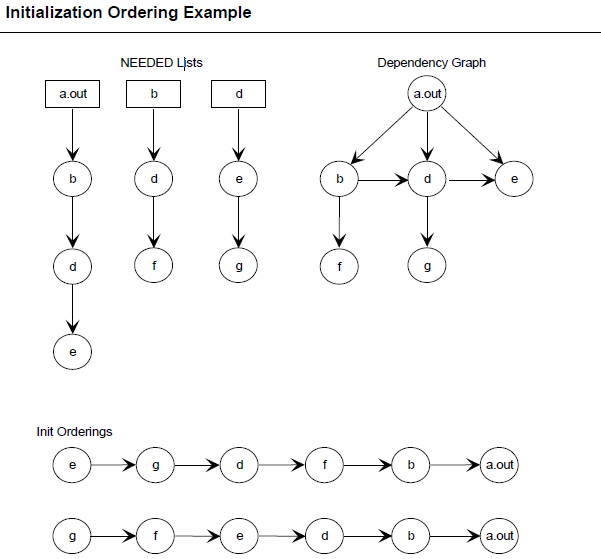

# Code Section

## 概述

在动态链接器创建了进程镜像，并且执行了重定位后，每一个共享目标文件都有机会去执行一些初始化的代码。所有的共享目标文件会在可执行文件获得权限之前进行初始化。

在调用目标文件 A 的初始化代码之前，会首先调用所有 A 依赖的共享目标文件的初始化代码。比如说，如果目标文件 A 依赖于另外一个目标文件 B，那么 B 就会在 A 的依赖列表中，这会被记录在动态结构的 DT_NEEDED 中。循环依赖的初始化是未被定义的。

目标文件的初始化通过递归每一个被依赖的表项来完成。只有当一个目标文件依赖的所有的目标文件都处理完自己的依赖后，这个目标文件才会执行初始化代码。

下面的例子解释了两种正确的可以用来生成给定例子的顺序。在这个例子中，a.out 依赖于b，d 以及 e。b依赖于d 和 f，并且 d 依赖于 e 和 g。根据这个信息，我们可以画出如下的依赖图。那么我们上面所说的算法，将允许我们按照如下的顺序进行初始化。

类似的，共享目标文件也会有结束的函数，这些函数在进程完成自己的终止序列时通过 atexit 机制来执行。动态链接器调用终止函数的顺序恰好与上面初始化的顺序相反。动态链接器将会确保它只会执行初始化或者终止函数最多一次。

共享目标文件通过动态结构中的 DT_INIT 和 DT_FINI 来指定它们的初始化以及结束函数。在一般情况下，这些函数在.init节与.fini节中。

注意：

>   尽管ateixt终止处理函数通常来说会被执行，但它并不会保证在程序消亡时被执行。更特殊的是，如果程序调用了_exit函数或者进程由于接收到一个信号后消亡了，那么它将不会执行对应的函数。

动态链接器并不负责调用可执行文件的 .init 节或者利用 atexit 注册可执行文件的 .fini 节。由用户通过 atexit 机制指定的终止函数必须在所有共享目标文件的结束函数前执行。

## .init & .init_array

此节区包含可执行指令，是进程初始化代码的一部分。程序开始执行时，系统会在开始调用主程序入口（通常指 C 语言的 main 函数）前执行这些代码。

## .text

此节区包含程序的可执行指令。

## .fini & .fini_array

此节区包含可执行的指令，是进程终止代码的一部分。程序正常退出时，系统将执行这里的代码。
