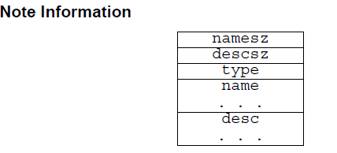
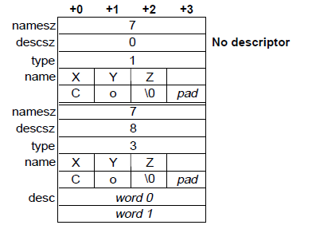
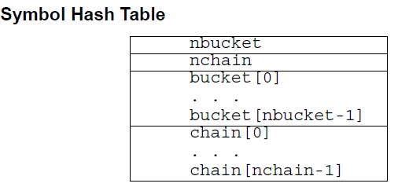
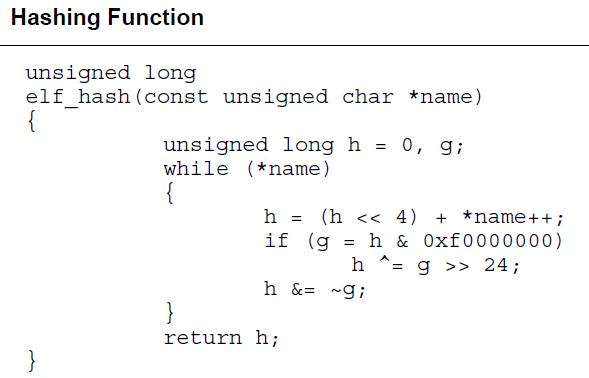

# Misc Sections

## Note related sections

有时候生产厂商或者系统构建者可能需要使用一些特殊的信息来标记ELF文件，从而其它程序可以来检查该 ELF 文件的一致性以及兼容性。节区类型为 SHT_NOTE 或者程序头部类型为 PT_NOTE 的元素用于来实现这个目的，它们中对象的表项可能包含一到多个，每一个表项都是目标处理器格式的 4 字节数组。下面给出了一些可能的注释信息。但是这并不在 ELF 文件的规范内。

-   namesz 与 name
    -   name 的前 namesz 字节包含了一个以 NULL 结尾的字符串，这表示该项的拥有者或者发起人。但是目前并没有避免冲突的格式化的命名机制。一般来说，生产厂商会使用他们自己公司的名字，例如“XYZ Computer Company”来当做对应的标志。如果没有任何名字的话，namesz 应该是0。那么在 name的地方应该填充到 4 字节对齐。
-   descsz 与 desc
    -   desc 的前 descsz 字节包含了注释的描述。ELF 文件对于描述的内容没有任何约束。如果没有任何描述的话，descsz 应该为 0。当然，应该在 desc 处填充到 4 字节对齐。
-   type
    -   这个字段给出了描述的解释，对于不同那个的发起者来说，他们都必须控制自己的类型，对于同一类型来说，有可能有多个描述与其对应。因此，发起者必须能够识别名字以及类型以便于来理解对应的描述。目前来说，类型不能够为非负值，ELF 文件的规范里并不定义描述符的意思。这也是为什么 type 在前面。

下面给出一个简单的例子来说明一下

这里包含了两个表项。

在 Linux 中，与 Note 相关的节包含了 ELF 文件中的一些注释信息，主要包含两个节

-   .note.ABI-tag
-   .note.gnu.build-id

## .gnu.hash

注：本部分主要参考https://blogs.oracle.com/ali/gnu-hash-elf-sections。

在 ELF 良好的可扩展性的帮助下， GNU 为 ELF 对象添加了一个新的哈希节，这个节的性能相比于原有的 `SYSV hash` 会好很多。该节用于快速根据符号名获取对应符号表中的索引。

更多内容请参考 https://blogs.oracle.com/ali/entry/gnu_hash_elf_sections。 **有待进一步学习。**

### ELF 标准

ELF 文件中的哈希表由 Elf32_Word 对象构成，用来支持符号表访问。下面的符号可以用来辅助解释符号表的组织情况，但是他们并不是 ELF 文件说明的一部分。

bucket 数组包含了 nbucket 个元素，chain 数组包含了 nchain 个元素，所有的数组的下标都是以 0 开始。bucket 和 chain 都包含符号表索引。chain 数组中的元素是和符号表中的元素一一对应的，因此符号表的元素个数必须和 nchain 的大小相同，故而符号表的索引同样可以作为 chain 表的索引。下面展示的哈希函数接受一个符号名作为输入，然后返回一个值，这个值可能被用于计算 bucket 的索引。因此，如果哈希函数针对于某个名字返回值 x，那么 `bucket[x%nbucket] ` 给出了一个索引 y，可以用来索引符号表，也可以用来索引 chain 表。如果符号表的对应索引并不是所想要的哪一个，那么 chain[y] 就会给出同一个哈希值的下一个符号表中表项的位置，即可以用来防止出现哈希值一样的情况。因此我们可以跟着 chain 链一直搜索直到遇到所想要的符号，或者遇到值为 `STN_UNDEF` 的 chain 的表项。

## .eh_frame related

.eh_frame_hdr

.eh_frame
