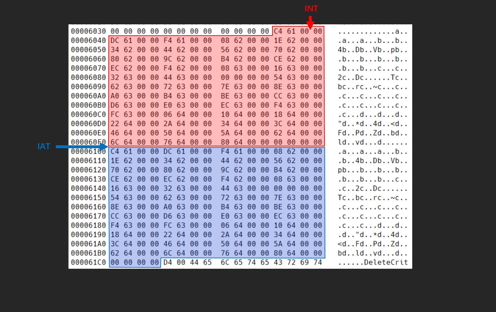
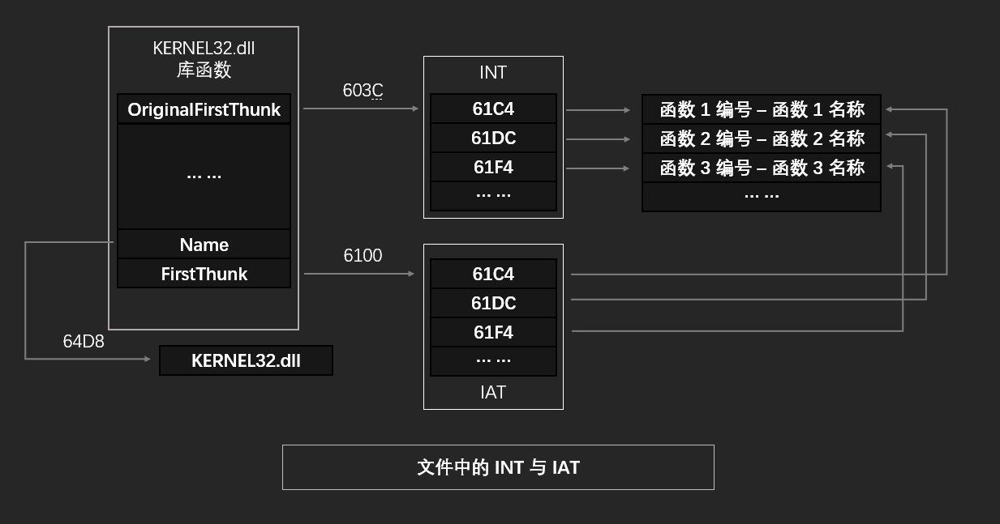

# 导入表

当可执行文件使用外来 DLL 的代码或数据时，需要 Windows 装载器记录所有要导入的函数和数据，并将 DLL 装载到可执行文件的虚拟地址空间中；装载器会确保可执行文件运行需要的所有 DLL 都被装载。

但对于可执行文件，它无法确定导入函数在内存中的位置，于是 Windows 装载器在装载 DLL 时将定位导入函数需要的信息写入到 IAT(Import Address Table，导入地址表)。待执行中遇到导入函数的调用时，就通过 IAT 确定导入函数在内存中的位置。

导入表相关数据包括 `IMAGE_IMPORT_DESCRIPTOR` 和 `IMAGE_IMPORT_BY_NAME` 以及相应的字符串数据。导入表是用来修正并存储 DLL 装载进内存后对应函数实际地址的数据节。

## INT 与 IAT

`DataDirectory[1]` 处保存着 IMPORT TABLE（即导入表）的 RVA。该 RVA 指向 `IMAGE_IMPORT_DESCRIPTOR` 结构体数组，`IMAGE_IMPORT_DESCRIPTOR` 结构体记录着 PE 文件导入库文件所需的信息。

```c
typedef struct _IMAGE_IMPORT_DESCRIPTOR {
  union {
    DWORD Characteristics;
    DWORD OriginalFirstThunk;       // 导入名称表 `INT` 的 RVA
  };
  DWORD TimeDateStamp;
  DWORD ForwarderChain;
  DWORD Name;                       // 库名称字符串 RVA
  DWORD FirstThunk;                 // 导入地址表 `IAT` 的 RVA
} IMAGE_IMPORT_DESCRIPTOR;
```

接下来对结构体中重要的成员说明一下：

- **`OriginalFirstThunk` 指向 INT(Import Name Table)。**
- **`Name` 指向导入函数所属的库文件名称。**
- **`FirstThunk` 指向 IAT(Import Address Table)。**

`INT` 与 `IAT` 也并称做双桥结构。`INT` 数组中的每一个指针都指向一个 `IMAGE_IMPORT_BY_NAME` 结构体，文件中 `IAT` 也是。`IMAGE_IMPORT_BY_NAME` 结构体记录着导入函数所需的信息。

```c
typedef struct _IMAGE_IMPORT_BY_NAME {
  WORD Hint;                        // 
  BYTE Name[1];                     // 函数名称字符串
} IMAGE_IMPORT_BY_NAME, *PIMAGE_IMPORT_BY_NAME;
```

- **`Hint` 成员表示函数的编号。通常在 DLL 中对每一个函数都进行了编号，定位函数时可以通过名称定位，也可以通过编号定位。**
- **`Name[1]` 成员是一个以 "\0" 为结尾的 ANSI 字符串，表示函数名称。**

接下来看一下示例文件中的 `IMAGE_IMPORT_DESCRIPTOR` 结构体数组：

```text
RVA       Data      Description               Value
----------------------------------------------------------
00006000  0000603C  Import Name Table RVA
00006004  00000000  Time Data Stamp
00006008  00000000  Forward Chain
0000600C  000064D8  Name RVA                  KERNEL32.dll
00006010  00006100  Import Address Table RVA  
----------------------------------------------------------
00006014  0000608C  Import Name Table RVA
00006018  00000000  Time Data Stamp
0000601C  00000000  Forward Chain
00006020  00006558  Name RVA                  msvcrt.dll
00006024  00006150  Import Address Table RVA
----------------------------------------------------------
00006028  00000000
0000602C  00000000
00006030  00000000
00006034  00000000
00006038  00000000
----------------------------------------------------------
```

接下来看一下示例文件的 `INT` 与 `IAT`：



可以看到虽然两者指向的是不同的位置，但是两者保存的数据却完全相同。为什么完全相同的结构体要保存两份呐？这就需要先了解 `INT` 和 `IAT` 的作用，以及它们之间的关系。首先看一下文件中 `INT` 与 `IAT` 之间的关系。



两者虽说是不同的指针，但指针内容完全相同，最终也都指向同样的结构体数组。也就是说，如果要定位一个库文件中的函数，既能通过 `INT` 定位，也能通过 `IAT` 定位。
当程序装载到内存时，会将导入函数的地址写入到 `IAT` 中，以方便引用。IAT 更新地址值的过程如下：

1. 读取 `IMAGE_IMPORT_DESCRIPTOR` 的 `Name` 成员，获取库名称字符串 "KERNEL32.dll"
2. 装载对应的库 -> `LoadLibrary["KERNEL32.dll"]`
3. 读取 `IMAGE_IMPORT_DESCRIPTOR` 的 `OriginalFirstThunk` 成员，获取 `INT` 地址
4. 读取 `INT` 数组中的值，获取对应 `IMAGE_IMPORT_BY_NAME` 结构体地址
5. 读取 `IMAGE_IMPORT_BY_NAME` 的 `Hint` 或 `Name` 成员，获取对应函数的起始地址 -> `GetProcAddress('DeleteCriticalSection')`
6. 读取 `IMAGE_IMPORT_DESCRIPTOR` 的 `FirstThunk` 成员，获取 `IAT` 地址
7. 将第 5 步得到的函数地址写入到 `IAT` 数组中对应的项
8. 重复 4 - 7 步，直到 `INT` 结束（即遇到NULL时）

接下来看一下在内存中 `INT` 和 `IAT` 之间的关系。


**在内存中，通过 `INT` 可以找到函数的名称或函数的编号，通过 `IAT` 可以找到函数指令代码在内存空间中的实际地址。**
在 x32dbg 中查看一下程序的 IAT:


此时 `IAT` 中的指针已经全部替换成了函数在内存中的实际地址。

## 绑定导入

绑定导入是一种提高 PE 加载速度的技术。它只影响加载的过程，并不影响 PE 最终的加载结果和运行结果。如果一个 PE 文件要导入的函数很多，那么在装载时就会占用一部分时间来完成函数导入，这会使得 PE 的装载时间变长。**绑定导入将 IAT 地址的修正工作提前到装载前进行。要么由用户手动完成，要么由专门的绑定工具完成；然后在 PE 文件中声明绑定导入数据，以此告诉装载器不必重复装载。**

但是在 Windows 的不同系统中动态链接库的基址是不同的，这样就导致绑定的地址出错而导致程序无法运行。这点也容易解决。**假定 PE 装载前对 IAT 的修正都是正确的，那么运行时就省去了修正的步骤；同样 PE 装载有检错机制，如果检测出错误，PE 加载器会在装载时重新对 IAT 进行修正。**

**总的来说，Windows 在装载目标 PE 文件相关的动态链接库时，会首先检查这些地址是否正确合法，包括检查当前系统的 DLL 版本是否符合绑定导入结构中描述的版本号哦，如果不符合或者 DLL 需要被重新定位，装载器就会遍历 OriginalFirstThunk 指向的数组计算新的地址，并将新的地址写入到 IAT 中。**

