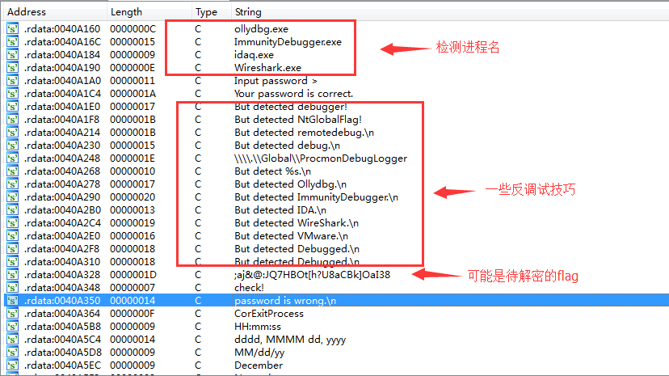
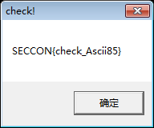

# 反调试技术例题

我们现在来分析一道2016年SecCon的`anti-debugging`题, 题目下载链接: [bin.exe](https://github.com/ctf-wiki/ctf-challenges/blob/master/reverse/anti-debug/2016_seccon/anti_debugging_100/bin.exe)

这是一个32位的PE文件, 是一个控制台程序, 我们直接运行, 会要求输入`password`. 当你输入一个错误的`password`时则会提示你`password is wrong`.


我们用IDA打开来看下, 最快速的方式就是直接查看字符串, 根据`password is wrong`找到关键代码. IDA显示的结果如下图:



显然, 字符串表明程序中可能有各种检测, 比如检测进程名`ollydbg.exe`, `ImmunityDebugger.exe`, `idaq.exe`和`Wireshark.exe`. 然后也有其他的检测. 我们也看到了字符串`password is wrong`和`You password is correct`的字样. 同时还发现了一个很有可能就是待解密的flag的字符串. 那么我们就先根据`password is wrong`的交叉引用来到关键函数处.

如下所示: 程序果然使用了大量的反调试技巧.

``` c
int __cdecl main(int argc, const char **argv, const char **envp)
{
  v23 = 0;
  memset(&v24, 0, 0x3Fu);
  v22 = 1;
  printf("Input password >");
  v3 = (FILE *)sub_40223D();
  fgets(&v23, 64, v3);
  strcpy(v21, "I have a pen.");
  v22 = strncmp(&v23, v21, 0xDu); // 1. 直接比较明文字符串与输入字符串
  if ( !v22 )
  {
    puts("Your password is correct.");
    if ( IsDebuggerPresent() == 1 )     // 2. API: IsDebuggerPresent()
    {
      puts("But detected debugger!");
      exit(1);
    }
    if ( sub_401120() == 0x70 )         // 3. 检测PEB的0x68偏移处是否为0x70. 检测NtGlobalFlag()
    {
      puts("But detected NtGlobalFlag!");
      exit(1);
    }

    /*  BOOL WINAPI CheckRemoteDebuggerPresent(
     *    _In_    HANDLE hProcess,
     *    _Inout_ PBOOL  pbDebuggerPresent
     *  );
     */
    v4 = GetCurrentProcess();
    CheckRemoteDebuggerPresent(v4, &pbDebuggerPresent);
    if ( pbDebuggerPresent )            // 4. API: CheckRemoteDebuggerPresent()
    {
      printf("But detected remotedebug.\n");
      exit(1);
    }
    v13 = GetTickCount();
    for ( i = 0; i == 100; ++i )
      Sleep(1u);
    v16 = 1000;
    if ( GetTickCount() - v13 > 1000 )  // 5. 检测时间差
    {
      printf("But detected debug.\n");
      exit(1);
    }
    lpFileName = "\\\\.\\Global\\ProcmonDebugLogger";
    if ( CreateFileA("\\\\.\\Global\\ProcmonDebugLogger", 0x80000000, 7u, 0, 3u, 0x80u, 0) != (HANDLE)-1 )
    {
      printf("But detect %s.\n", &lpFileName);      // 6. 检测ProcessMonitor
      exit(1);
    }
    v11 = sub_401130();     // 7. API: CreateToolhelp32Snapshot()检测进程
    if ( v11 == 1 )
    {
      printf("But detected Ollydbg.\n");
      exit(1);
    }
    if ( v11 == 2 )
    {
      printf("But detected ImmunityDebugger.\n");
      exit(1);
    }
    if ( v11 == 3 )
    {
      printf("But detected IDA.\n");
      exit(1);
    }
    if ( v11 == 4 )
    {
      printf("But detected WireShark.\n");
      exit(1);
    }
    if ( sub_401240() == 1 )    // 8. 通过vmware的I/O端口进行检测
    {
      printf("But detected VMware.\n");
      exit(1);
    }
    v17 = 1;
    v20 = 1;
    v12 = 0;
    v19 = 1 / 0;
    ms_exc.registration.TryLevel = -2;  // 9. SEH
    printf("But detected Debugged.\n");
    exit(1);
  }
  printf("password is wrong.\n");
  return 0;
}
```

我在代码里写了注释, 列出了其中所使用的9个保护技术部分. 我们来逐一分析一下吧.

## 比较明文字符串

``` c
printf("Input password >");
v3 = (FILE *)sub_40223D();
fgets(&v23, 64, v3);
strcpy(v21, "I have a pen.");
v22 = strncmp(&v23, v21, 0xDu); // 1. 直接比较明文字符串与输入字符串
if ( !v22 )  {
    ......
}
```

这里就是输出`Input password >`. 然后用`fgets()`获取用户输入的字符串, 将`I have a pen.`复制到`v21`的缓冲区中, 然后用`strncmp`比对用户输入与`I have a pen.`的内容, 并将比较结果返回给`v22`. 以下会根据`v22`, 也就是根据输入的`password`是否正确, 而进行跳转.

## IsDebuggerPresent()

``` c
puts("Your password is correct.");
if ( IsDebuggerPresent() == 1 )     // 2. API: IsDebuggerPresent()
{
    puts("But detected debugger!");
    exit(1);
}
```

显然, 输入的`password`正确, 就会输出提示`Your password is correct.`. ??? 不觉得奇怪吗. 难道`I have a pen.`就是我们的flag了吗? 不不不当然不是. 这其实是一个陷阱, 既然你知道了`I have a pen.`那么就肯定有通过某种逆向手段在对程序进行分析. 所以接下来的部分就开始进行一些反调试或其他的检测手段(实际中也可以出现这样的陷阱).

一开始的是`IsDebuggerPresent()`, 根据返回结果判断是否存在调试.如果不太清楚的话, 可以返回去看 [IsDebuggerPresent()](./isdebuggerpresent.md) 篇

## NtGlobalFlag

接下来是检测`NtGlobalFlag`这个字段的标志位. 通过检测PEB的字段值是否为`0x70`来检测调试器, 如果不太清楚的话, 可以返回去看 [NtGlobalFlag](./ntglobalflag.md) 篇

``` c
if ( sub_401120() == 0x70 )         // 3. 检测PEB的0x68偏移处是否为0x70. 检测NtGlobalFlag()
{
    puts("But detected NtGlobalFlag!");
    exit(1);
}
```

那我们来简单看一下`sub_401120()`好了

``` c
int sub_401120()
{
  return *(_DWORD *)(__readfsdword(48) + 0x68) & 0x70;
}
```

`0x68`是PEB的`NtGlobalFlag`字段对应偏移值. `0x70`是`FLG_HEAP_ENABLE_TAIL_CHECK (0x10)`, `FLG_HEAP_ENABLE_FREE_CHECK (0x20)` 和`FLG_HEAP_VALIDATE_PARAMETERS (0x40)`这三个标志

## CheckRemoteDebuggerPresent


``` c++
/*  BOOL WINAPI CheckRemoteDebuggerPresent(
 *    _In_    HANDLE hProcess,
 *    _Inout_ PBOOL  pbDebuggerPresent
 *  );
 */
v4 = GetCurrentProcess();
CheckRemoteDebuggerPresent(v4, &pbDebuggerPresent);
if ( pbDebuggerPresent )            // 4. API: CheckRemoteDebuggerPresent()
{
    printf("But detected remotedebug.\n");
    exit(1);
}
```
这里我顺便在注释里列出了`CheckRemoteDebuggerPresent()`这个API的函数原型. 如果检测到调试器的存在, 会将`pbDebuggerPresent`设置为一个非零值. 根据其值检测调试器([CheckRemoteDebuggerPresent()](./checkremotedebuggerpresent.md) 篇)


## 时间差检测

``` c
v13 = GetTickCount();
for ( i = 0; i == 100; ++i )    // 睡眠
    Sleep(1u);
v16 = 1000;
if ( GetTickCount() - v13 > 1000 )  // 5. 检测时间差
{
    printf("But detected debug.\n");
    exit(1);
}
```

`GetTickCount`会返回启动到现在的毫秒数, 循环里光是`sleep(1)`就进行了100次, 也就是100毫秒. 两次得到的时间作差如果大于1000毫秒, 时差明显大于所耗的时间, 也就间接检测到了调试.


## ProcessMonitor

``` c
lpFileName = "\\\\.\\Global\\ProcmonDebugLogger";
if ( CreateFileA("\\\\.\\Global\\ProcmonDebugLogger", 0x80000000, 7u, 0, 3u, 0x80u, 0) != (HANDLE)-1 )
{
    printf("But detect %s.\n", &lpFileName);      // 6. 检测ProcessMonitor
    exit(1);
}
```

这里通过检测设备文件`\\\\.\\Global\\ProcmonDebugLogger`来检测`ProcessMonitor`

## 检测进程名

这里通过执行`sub_401130()`函数来检测进程, 并根据检测到的不同进程, 返回相应的值.

``` c
v11 = sub_401130();     // 7. API: CreateToolhelp32Snapshot()检测进程
if ( v11 == 1 )
{
    printf("But detected Ollydbg.\n");
    exit(1);
}
if ( v11 == 2 )
{
    printf("But detected ImmunityDebugger.\n");
    exit(1);
}
if ( v11 == 3 )
{
    printf("But detected IDA.\n");
    exit(1);
}
if ( v11 == 4 )
{
    printf("But detected WireShark.\n");
    exit(1);
}
```

我们就来看一下`sub_401130()`函数

``` c
signed int sub_401130()
{
  PROCESSENTRY32 pe; // [sp+0h] [bp-138h]@1
  HANDLE hSnapshot; // [sp+130h] [bp-8h]@1
  int i; // [sp+134h] [bp-4h]@1

  pe.dwSize = 296;
  memset(&pe.cntUsage, 0, 0x124u);
  hSnapshot = CreateToolhelp32Snapshot(2u, 0);
  for ( i = Process32First(hSnapshot, &pe); i == 1; i = Process32Next(hSnapshot, &pe) )
  {
    if ( !_stricmp(pe.szExeFile, "ollydbg.exe") )
      return 1;
    if ( !_stricmp(pe.szExeFile, "ImmunityDebugger.exe") )
      return 2;
    if ( !_stricmp(pe.szExeFile, "idaq.exe") )
      return 3;
    if ( !_stricmp(pe.szExeFile, "Wireshark.exe") )
      return 4;
  }
  return 0;
}
```

这里使用了API: `CreateToolhelp32Snapshot`来获取当前的进程信息. 并在for循环里依次比对. 如果找到指定的进程名, 就直接返回相应的值. 然后根据返回值跳转到不同的分支里.

## 检测VMware

检测VMware也是检测一些特征. 根据检测的结果进行判断.

``` c
if ( sub_401240() == 1 )    // 8. 通过vmware的I/O端口进行检测
{
    printf("But detected VMware.\n");
    exit(1);
}
```

来看`sub_401240()`函数.

``` c
signed int sub_401240()
{
  unsigned __int32 v0; // eax@1

  v0 = __indword(0x5658u);
  return 1;
}
```

这是VMware的一个"后门"I/O端口, `0x5658 = "VX"`. 如果程序在VMware内运行, 程序使用`In`指令通过`0x5658`端口读取数据时, `EBX`寄存器的值就会变为`0x564D5868`(`0x564D5868 == "VMXh"`)

看IDA反编译出的伪C代码并不很直观地体现这点, 我们看汇编代码就清楚了

``` asm
.text:0040127A                 push    edx
.text:0040127B                 push    ecx
.text:0040127C                 push    ebx
.text:0040127D                 mov     eax, 564D5868h   //  <------
.text:00401282                 mov     ebx, 0
.text:00401287                 mov     ecx, 0Ah
.text:0040128C                 mov     edx, 5658h   //  <------
.text:00401291                 in      eax, dx
.text:00401292                 pop     ebx
.text:00401293                 pop     ecx
.text:00401294                 pop     edx
```

更多阅读: [E-cards don?t like virtual environments](https://isc.sans.edu/diary/E-cards+don%3Ft+like+virtual+environments/3190)

## SEH

``` c
v17 = 1;
v20 = 1;
v12 = 0;
v19 = 1 / 0;    // 9. SEH
ms_exc.registration.TryLevel = -2;
printf("But detected Debugged.\n");
exit(1);
```

接下来这一段, 很奇怪不是吗. 这里`v19 = 1 / 0;`明显是不合常理的, 会产生一个除零异常. 而后面的`ms_exc.registration.TryLevel = -2;`这是解除异常, `TryLevel=TRYLEVEL_NONE (-2)` . 来看汇编代码.

```
.text:004015B8                 mov     [ebp+var_88], 1
.text:004015C2                 mov     [ebp+var_7C], 1
.text:004015C9                 mov     [ebp+var_9C], 0
.text:004015D3                 mov     [ebp+ms_exc.registration.TryLevel], 0
.text:004015DA                 mov     eax, [ebp+var_7C]
.text:004015DD                 cdq
.text:004015DE                 idiv    [ebp+var_9C]
.text:004015E4                 mov     [ebp+var_80], eax
.text:004015E7                 mov     [ebp+ms_exc.registration.TryLevel], 0FFFFFFFEh
.text:004015EE                 jmp     short loc_40160A
```

在这里的`idiv [ebp+var_9C]`触发异常后就由程序注册的异常处理函数接管, 而如果没有在异常处理程序入口设下断点的话, 程序就容易跑飞.

## 获取flag

但整个看下了. 怎么感觉关flag一点事都没有了呢? 还有没有记起之前在字符串窗口看到的疑似是那个待解密的flag的字符串? 实际上由于IDA反编译的限制, 使得反编译出的伪C代码并不正确. 比如在最后一段的`printf("But detected Debugged.\n");`这里, 我们来看具体的汇编代码.

``` asm
.text:00401627                 call    sub_4012E0
.text:0040162C                 movzx   eax, ax
.text:0040162F                 mov     [ebp+var_A8], eax
.text:00401635                 cmp     [ebp+var_A8], 0      // <------
.text:0040163C                 jz      short loc_401652     // <------
.text:0040163E                 push    offset aButDetectedD_2 ; "But detected Debugged.\n"
.text:00401643                 call    _printf
.text:00401648                 add     esp, 4
.text:0040164B                 push    1               ; int
.text:0040164D                 call    _exit
```

实际上这一段代码并没有被IDA反编译出来. 而`loc_401652`位置则是一串代码, 亮点在于使用了一个`MessageBoxA`的函数. 而且函数参数之一就是我们的待解密flag. 那么我们就可以在输入`I have a pen.`后, 在`if ( !v22 )`跳转的汇编代码部分, 将其手动改为跳转到flag解密及弹出`messagebox`的部分运行, 让程序自己帮忙解密并输出, 就可以了.

操作如下图所示:


这里是输入`I have a pen.`后的跳转部分, 因为正常跳转到的部分, 全是一些检测调试的内容, 所以我们直接跳到代码解密的部分. 也就是`00401663`的位置.


在`00401663`以上的`mov-cmp-jnz`也是一个验证部分, 就不管了, 直接跳到`00401663`这里的`mov ecx, 7`这里运行解密代码, 并顺着执行`MessageBoxA()`弹出消息框, 拿到flag


